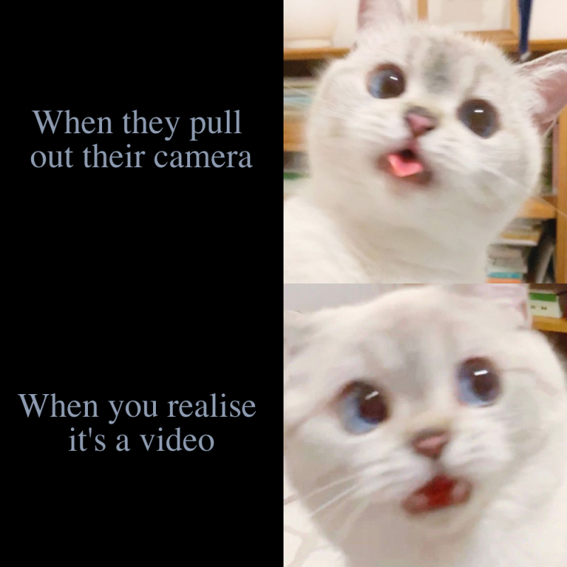
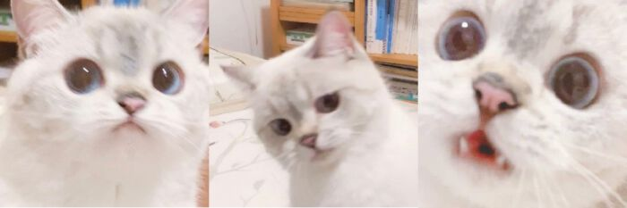

# Welcome to my STATS 220 page! 


## Here is my first meme!



My motivation behind creating this meme was to design a cute cat-related meme that was both funny and relatable for individuals living in modern times. Although following the basic meme format of four sections used by many popular memes. My meme captures the amusing moments many have experienced when they pose for a video. I consider my meme to be new and original as the combination of this plot and the use of the two cat images has not been seen on any other pages.

The cat images I used for my meme belong to a cat famous for their expressions. For people who are curious of the cats details, I've listed **5 facts** about her!
The cat is
1. called **Nana**
2. is a _British Shorthair_
3. lives in _China_
4. is famous on Chinese social media site called _Weibo_
5. and currently has _304k followers_ on the platform

For more photos from Nana you can view her [Weibo account](https://weibo.com/u/6483141345)



Below I have included the R code I used to create this new meme.

## R Code

#### For meme

```r

library(magick)

#square one
camera_text <- image_blank(width = 500, 
                           height = 500, 
                           color = "#000000") %>%
  image_annotate(text = "When they pull \nout their camera", 
                 color = "#8e9cb2",
                 size = 60,
                 font = "Times New Roman",
                 gravity = "center")

#square two
posing_cat <- image_read("https://static.boredpanda.com/blog/wp-content/uploads/2020/07/expressive-cat-nana-1-19-5f16d006edb0f__700.jpg") %>%
  image_scale(500)

#square three
video_text <- image_blank(width = 500, 
                          height = 500, 
                          color = "#000000") %>%
  image_annotate(text = "When you realise \nit's a video", 
                 color = "#8e9cb2",
                 size = 60,
                 font = "Times New Roman",
                 gravity = "center")

#square four
shocked_cat <- image_read("https://static.boredpanda.com/blog/wp-content/uploads/2020/07/expressive-cat-nana-1-1-5f16cfece24f8__700.jpg") %>%
  image_scale(500)

#appending first row
top_row <- image_append(c(camera_text, posing_cat))
bottom_row <- image_append(c(video_text, shocked_cat))

meme <- c(top_row, bottom_row) %>%
  image_append(stack = TRUE) %>%
  image_scale(800)

image_write(meme, "my_meme.png")

```
#### For Nana's photos

```r

pic1 <- image_read("https://www.boredpanda.com/blog/wp-content/uploads/2020/07/expressive-cat-nana-1-4-5f16cff195d6f__700.jpg") %>%
  image_scale(200)

pic2<- image_read("https://nextshark.com/wp-content/uploads/2020/07/1sdkyghfkawhdkjhyawgd.jpg") %>%
  image_scale(200)

pic3 <- image_read("https://i.pinimg.com/474x/2e/27/76/2e2776ddb1dcb8f96c498ba5e1960bdc.jpg") %>%
  image_scale(200)

nana <- c(pic1, pic2, pic3) %>%
  image_append() %>%
  image_scale(400)

image_write(nana, "nana_cat.png")


```
